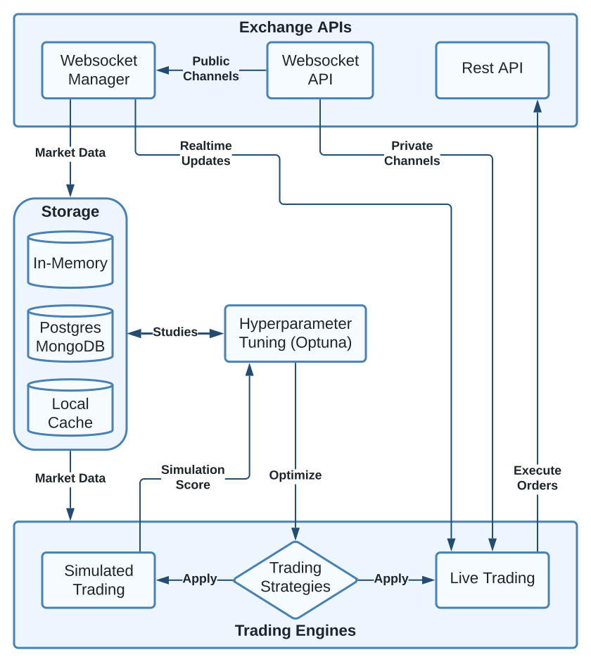

# Tradeforce

### Python Trading Framework

Tradeforce is a comprehensive Python-based trading framework designed for
high-performance backtesting, hyperparameter optimization, and live trading.
By leveraging Just-In-Time (JIT) machine code compilation, Tradeforce is able
to run trading simulations on whole markets (100+ assets) covering years of
historical data. This benefit of speed allows to find optimal hyperparameters of
trading algorithms within large search spaces in a reasonable amount of time.
Setups via Docker compose stack offer flexible deployment options and
enable scalability to cluster environments.

### Features

- Numba accelerated simulations, processing 100k+ records / second / thread
- Customizable trading strategies
- Dedicated market server supporting 100+ simultaneous WebSocket connections
- Backend support for PostgreSQL and MongoDB
- Local caching of market data in Arrow format for rapid loading times
- Hyperparameter optimization through the Optuna framework
- Live trading capabilities
- Easy and flexible deployment via Docker
- Scalable to cluster environments, such as Kubernetes
- Jupyter Notebook integration for analysis and visualization of results


### Feature support

Supported features depend on the choice of database backend:

|                 | Market Server | Simulations | Live Trading | Optuna |
|-----------------|:-------------:|:-----------:|:------------:|:------:|
| **Postgres**    | &#9745;       | &#9745;     | &#9745;      | &#9745;|
| **MongoDB**     | &#9745;       | &#9745;     | &#9745;      | &#9744;|
| **Local Cache** | &#9745;       | &#9745;     | &#9744;      | &#9744;|

For a more detailed explanation of the differences see the [Storage] section of the documentation.

>**Note** - The recommended [setup with Docker compose](#docker-recommended) includes\
> Postgres as backend and is therefore fully featured.

## Architecture



> **Note** - See the [Documentation] for a more detailed description of the architecture.

## Installation

### Docker (recommended)

>**Requirements**
>
>- [Docker Desktop]
>- Docker compose (included in Docker Desktop)

1. Download the [docker] and [examples] folders from this repository\
    or ``git clone`` the whole repository and ``cd`` into the ``docker`` folder:

    ```shell
    git clone https://github.com/cyclux/tradeforce.git
    cd docker
    ```

2. Spin up the Docker compose stack:

    ```shell
    docker compose up

    # or detached to run in the background
    # and get the console back
    docker compose up -d
    ```

    This will spin up following services specified in [docker/docker-compose.yml]:
    - **docker_tradeforce**: Tradeforce instance via [examples/docker_default.py].
    - **docker_db**: PostgreSQL database as backend.

    <!-- TODO: Add documentation for different deployments options -->
    Check out the [docker] folder for further examples of deployment options.

    >**Note** - On the first run of `docker compose up` the images of the services\
    > specified in [docker/docker-compose.yml] will be fetched from [Docker Hub].

### pip

> **Requirements**
>
>- Python 3.10+
>- Optional: Postgres or MongoDB instance.\
   See [feature support](#feature-support) for limitations without database backend.

1. #### Create virtual environment (optional)

    ```shell
    # Create environment
    python3 -m venv tradeforce

    # Activate environment
    source tradeforce/bin/activate
    ```
    > **Note** - The environment name "tradeforce" is arbitrary and can be changed.

2. #### Install via pip

    ```
    pip install tradeforce
    ```

## Usage

### Run modes

Tradeforce can be run in different modes depending on the use case:

- `run()`: Run "normal mode" primarily for fetching history (also [dedicated market server]) and [live trading].
- `run_sim()`: Run single simulation on historical data. See [simulator_simple_dict.py] as an example.
- `run_optuna()`: Run multiple simulations for hyperparameter optimization via [Optuna]. See [hyperparam_search.py]
                  and [hyperparam_search_multiprocess.py] as examples. Also [hyperparam_search_result_analysis.ipynb]
                  for a Jupyter notebook on analyzing the results.

> **Note** - See Documentation: [Run modes] for more details on how to use and configure the different run modes.

### Configuration

See the [Configuration Documentation] which details all the available config options.

Generally Tradeforce can either be configured via

-  **Python dictionary**:

    ```python
    from tradeforce import Tradeforce

    CONFIG = {
        ...
    }

    sim_result = Tradeforce(config=CONFIG).run_sim()
    ```

    > **Note** - See [simulator_simple_dict.py] for a working example.

- **YAML file**:

    ```python
    from tradeforce import Tradeforce

    sim_result = Tradeforce(config_file="config.yaml").run_sim()
    ```

    > **Note** - See [simulator_simple_yaml.py] and [config.yaml] for a working example.

### Shell in container

In some use cases it might be helpful to open a shell in the Tradeforce container.
For instance if `docker compose` is run in detached mode: `docker compose up -d`.

To connect to the Tradeforce container and open a bash shell run:

```shell
docker exec -it tradeforce bash
```

> **Note** - Here ``tradeforce`` refers to the `container_name` specified in [docker/docker-compose.yml]\
> and might defer depending on the deployment option or setup.

## DISCLAIMER
> **Warning** Use at your own risk! Tradeforce is currently in beta, and bugs may occur.\
> Furthermore, there is no guarantee that strategies that have performed well \
> in the past will continue to do so in the future.


## Build

### Get requirements.txt from container
```
cd /path/to/tradeforce/Dockerfile
docker build -t tradeforce:build --target build .
docker create --name tradeforce_build tradeforce:build
docker cp tradeforce_build:/opt/tradeforce/requirements.txt ./requirements.txt
```
### Build production stage
```
cd /path/to/tradeforce/Dockerfile
docker build -t cyclux/tradeforce:latest -t cyclux/tradeforce:0.0.1 --target production .
docker push -a cyclux/tradeforce
```
> **Note** - Here ``cyclux`` refers to the Docker Hub repo / user name and needs to be changed accordingly.


[Docker Desktop]: https://docs.docker.com/get-docker/
[Optuna]: https://optuna.org/

[docker]: tree/master/docker
[examples]: ../tree/master/examples

[simulator_simple_dict.py]: ../master/examples/simulator_simple_dict.py
[simulator_simple_yaml.py]: ../master/examples/simulator_simple_yaml.py
[config.yaml]: ../master/examples/config.yaml
[dedicated market server]: ../master/examples/dedicated_market_server.py
[live trading]: ../master/examples/live_trader_simple.py

[hyperparam_search.py]: ../master/examples/hyperparam_search.py
[hyperparam_search_multiprocess.py]: ../master/examples/hyperparam_search_multiprocess.py
[hyperparam_search_result_analysis.ipynb]: ../master/examples/hyperparam_search_result_analysis.ipynb

[docker/docker-compose.yml]: ../master/docker/docker-compose.yml
[examples/docker_default.py]: ../master/examples/docker_default.py

[Docker Hub]: https://hub.docker.com/r/cyclux/tradeforce/tags

[Documentation]: https://tradeforce.readthedocs.io/en/latest/
[Storage]: https://tradeforce.readthedocs.io/en/latest/index.html#storage
[Configuration Documentation]: https://tradeforce.readthedocs.io/en/latest/config.html
[Run modes]: https://tradeforce.readthedocs.io/en/latest/run_modes.html

