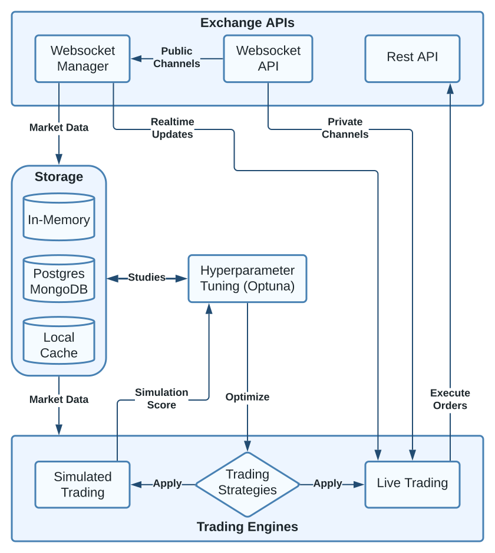

Tradeforce: A Python-based Trading Framework
============================================

.. Copy from section in README.md - Reflect changes in both files!

Tradeforce is a comprehensive Python-based trading framework designed for
high-performance backtesting, hyperparameter optimization, and live trading.
By leveraging Just-In-Time (JIT) machine code compilation, Tradeforce is able
to run trading simulations on whole markets (100+ assets) covering years of
historical data. This benefit of speed allows to find optimal hyperparameters of
trading algorithms within large search spaces in a reasonable amount of time.
Setups via Docker compose stack offer flexible deployment options and
enable scalability to cluster environments.

Architecture
------------

Exchange APIs
"""""""""""""

Technically, Tradeforce could process any type of time series or financial market datasets
like stock markets. However, for the sake of convenience the Bitfinex API is integrated
into the framework to provide access to a large amount of historical market data with ease.
Users can configure to fetch data for different timeframes (from days to years) and
resolutions (1-minute to 1-week candle intervals) for numerous assets. Tradeforce can also
maintain real-time market updates via WebSocket connections. For reference, see the
config options on :ref:`config:market_history` and :ref:`config:initial_relevant_assets`.

.. note::
  Currently only **Bitfinex Exchange** is supported as **Trading API** and **Data Source**.
  Additional Exchange APIs or Data Sources might be added in the future.

- **Websocket API**: Real-time market updates for all assets on Bitfinex. Public channels provide
  candle and trade data without authentication, just rate limits apply. Private channels
  provide user specific order and position updates: Authentication is required.
  See config options :py:attr:`~.run_live` and :py:attr:`~.credentials_path` for more details.

- **REST API**: Provides public endpoints for gathering asset status, metrics and metadata
  (not shown in diagram). As well as private endpoints (authentication required) to manage
  orders and wallets.

- **Websocket Manager**: Handles and maintains simultanious connections to the Bitfinex Websocket API,
  which may include 100+ assets of the market. Also provides methods for subscribing to channels and
  processing wallet and order updates.

Storage
"""""""

.. list-table::
  :widths: 25 25 25 25 25
  :header-rows: 1

  * -
    - Market Server
    - Simulations
    - Live Trading
    - Optuna
  * - **Postgres**
    - |checked|
    - |checked|
    - |checked|
    - |checked|
  * - **MongoDB**
    - |checked|
    - |checked|
    - |checked|
    - |unchecked|
  * - **Local Cache**
    - |checked|
    - |checked|
    - |unchecked|
    - |unchecked|

.. |checked|   unicode:: U+2611 .. BALLOT BOX WITH CHECK
.. |unchecked| unicode:: U+2610 .. BALLOT BOX

For storing historical trading data, Tradeforce currently supports Postgres and MongoDB
as database backends. However, only Postgres supports the full range of features and
is therefore the recommended default. MongoDB is supported for historical data
storage, live trading and standard simulations. However, hyperparameter optimization is not
suppported because Optuna relies on SQL / Postgres.

- **In-Memory**: Once the market history data is initially fetched from remote API or loaded
  from local cache or database, a mirror of the data is stored in memory for fast access
  (as Pandas DataFrame). All operations are performed on this in-memory data.

- **Postgres / MongoDB**: All market (candle history) and trading (e.g. buy / sell) data can be
  stored in a database. For hyperparameter optimization via Optuna, Postgres is required.
  It stores the optimization history and results (Studies) in Postgres to allow for
  sharding and and thus parallelization of the optimization process.
  For reference, see the config options at :ref:`config:backend` and `examples`_.

- **Local Cache**: If enabled (see :py:attr:`~.local_cache`), the market history data will get
  dumped into a local cache (as .arrow file) to avoid fetching the same data from the database
  backend or remote API again. It also significantly speeds up the initial loading of the data
  into memory. This is essential for hyperparameter optimization via Optuna, because the process
  requires to load the data many times.

Trading Engines
"""""""""""""""

Tradeforce allows to run trading strategies / algorithms as simulation or in live mode.
In simulation mode a performance score is returned. Using the Optuna framework, this score
can be optimized by searching for the ideal parameters of the implemented strategy.
In Optuna, an optimization process is referred to as a "study." Tradeforce returns a Study
object after a successful optimization run, which can be used for analyzing and visualizing
results within a Jupyter Notebook.

- **Trading Strategies**: A trading strategy / algorithm consists of three main functions:
  :py:func:`~.pre_process`, :py:func:`~.buy_strategy`, :py:func:`~.sell_strategy`. See
  :doc:`default_strategies` for implementation details. The strategy functions and its parameters
  get applied to either the live trader or the simulation engine (see :py:doc:`run_modes`).

- **Simulated Trading**: The simulation engine allows to run a trading strategy on historical
  market data. It returns a performance score (e.g. profit corrected for variance) for the given
  strategy and parameters (See return ``score`` of :py:meth:`~.run_sim`). The simulation engine
  can be used for hyperparameter optimization via Optuna.
  See :py:doc:`run_modes` : :py:meth:`~.run_sim_optuna` for more details.

- **Live Trading**: The live trader allows to run a trading strategy on the Bitfinex Exchange in
  real-time. It has access to historical market data as well as live updates via Websocket Manager.
  See :py:doc:`run_modes` : :py:meth:`~.run` for more details.

Hyperparameter Tuning
"""""""""""""""""""""

Tradeforce uses the Optuna framework for hyperparameter optimization. The parameters of a trading
strategy can be optimized by searching for the "ideal" values within a given search space.
Usually some kind of performance score is used as objective for optimization. In the default
implementation this is ``mean profit of subsets corrected for variance``, for details see
:py:func:`~.simulator_core.run`.

For `examples`_ of Optuna usage, see `hyperparam_search.py`_ and `hyperparam_search_multiprocess.py`_.
The results of an optimization run (called `Study`) are stored in the Postgres database backend and
can be analyzed and visualized within a Jupyter Notebook. See `hyperparam_search_result_analysis.ipynb`_.

Also see the Optuna documentation: https://optuna.readthedocs.io/en/stable/

.. toctree::
   :maxdepth: 1
   :caption: Contents:

   run_modes
   config
   history
   simulator
   default_strategies
   deployment

Indices and tables
==================

* :ref:`genindex`
* :ref:`modindex`
* :ref:`search`

.. _examples: https://github.com/cyclux/tradeforce/tree/master/examples
.. _hyperparam_search.py: https://github.com/cyclux/tradeforce/blob/master/examples/hyperparam_search.py
.. _hyperparam_search_multiprocess.py: https://github.com/cyclux/tradeforce/blob/master/examples/hyperparam_search_multiprocess.py
.. _hyperparam_search_result_analysis.ipynb: https://github.com/cyclux/tradeforce/blob/master/examples/hyperparam_search_result_analysis.ipynb